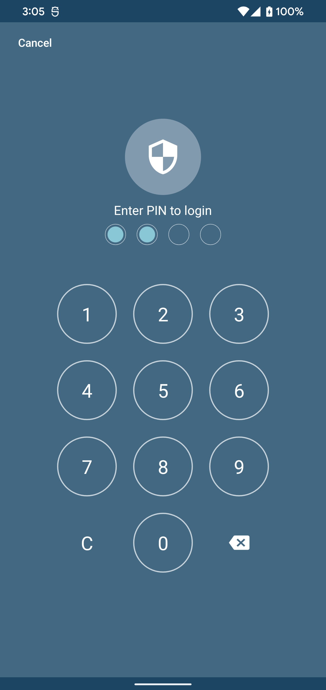

# AndroidPasscodeView

A simple passcode view similar to iOS lock screen.
<div style="text-align:center; width: 100%;">
   
</div>

## Usage

> Step 1: Add this your root build.gradle
```java
repositories {  
	...
    maven { url "https://jitpack.io" }
}

```
> Step 2: Add this your app build.gradle
```java
dependencies {
    implementation 'com.github.pisalcoding:android-passcode-view:1.0.0'
}
```

> Step 3: Usage
```xml
<me.pisal.passcodeview.PasscodeView
    android:id="@+id/pin_auth_view"
    android:layout_width="match_parent"
    android:layout_height="wrap_content"
    app:pcPinCount="4"/>
```

```kotlin
pinAuthView.onFilled = { pin ->
    // Use the pin value when the pin value is filled
}
```

